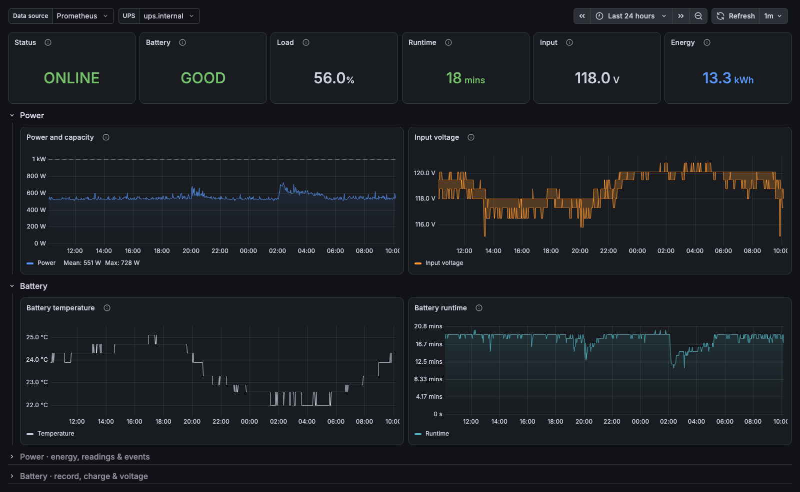
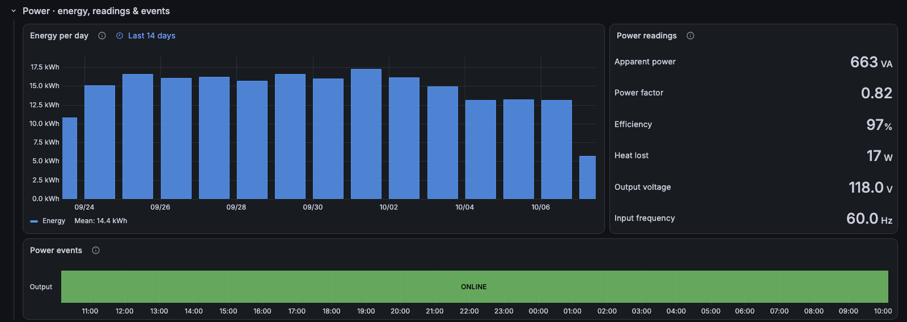
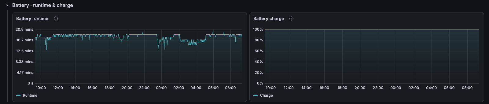

# APC UPS / Overview

APC UPS over SNMP: protection status, load against capacity, input quality, battery health, runtime and power events.

[grafana.com/grafana/dashboards/25867](https://grafana.com/grafana/dashboards/25867) · import ID `25867`

## Overview

The top row answers "am I protected?": output status, battery state, load, estimated runtime, input voltage and energy used. Below it, power drawn against what the UPS can deliver, input voltage, the battery record (replace flag, self-test result, last transfer reason) and battery temperature.

Collapsed rows:
- **Power · energy, readings & events:** energy per day, power readings and events (pass-through, input correction, self-test, on battery).
- **Battery · runtime & charge:** runtime estimate and charge over time.

Series that split across exporter restarts are merged per UPS.

## Requirements
- Prometheus `snmp_exporter` with the `apcups` module, scraping an APC UPS with a Network Management Card.
- Prometheus 2.33 or later, for negative offsets.

## Collapsed rows

### Power · energy, readings & events

### Battery · runtime & charge

