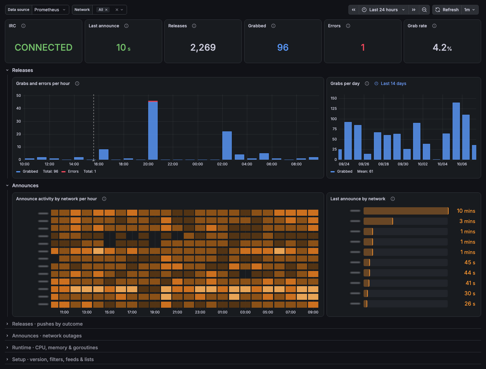
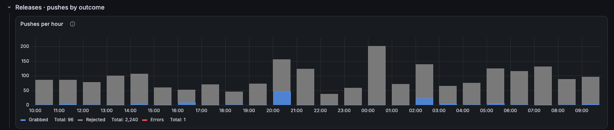
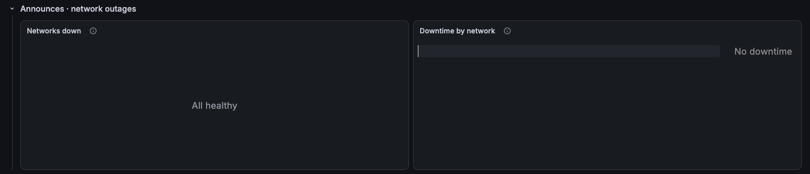
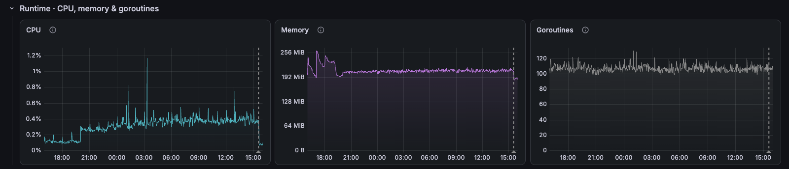
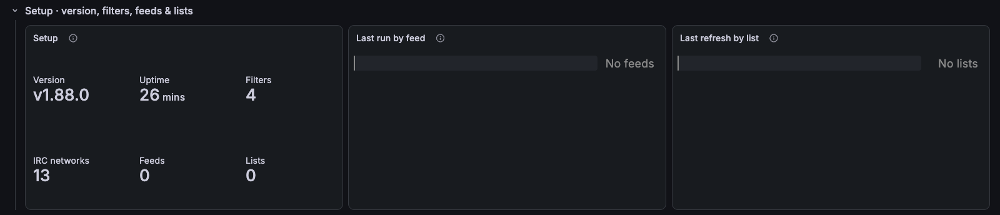

# autobrr / Overview

autobrr: IRC status, announces by network, and releases matched, grabbed and rejected.

[grafana.com/grafana/dashboards/25872](https://grafana.com/grafana/dashboards/25872) · import ID `25872`

## Overview

Built on the Prometheus metrics exported by [autobrr](https://github.com/autobrr/autobrr). The top row shows IRC status, the last announce, releases matched, releases grabbed, push errors and the grab rate in the selected range. Below it, grabs and errors per hour, grabs per day, announce activity by network per hour and the last announce by network.

Collapsed rows:
- **Releases · pushes by outcome:** pushes per hour: grabbed, rejected or failed with an error.
- **Announces · network outages:** IRC networks down over time and downtime by network.
- **Runtime · CPU, memory & goroutines:** autobrr CPU, memory and goroutines.
- **Setup · version, filters, feeds & lists:** version, uptime, enabled filters, networks, feeds and lists, and when each feed and list last ran.

Note: release counts come from autobrr's database, so release cleanup jobs don't skew them.

## Requirements
- autobrr with metrics enabled (`metricsEnabled = true` or `AUTOBRR__METRICS_ENABLED=true`, port 9074) scraped by Prometheus.
- Prometheus 2.33 or later, for negative offsets.
- The `network` variable filters the per-network panels.

## Collapsed rows

### Releases · pushes by outcome

### Announces · network outages

### Runtime · CPU, memory & goroutines

### Setup · version, filters, feeds & lists

