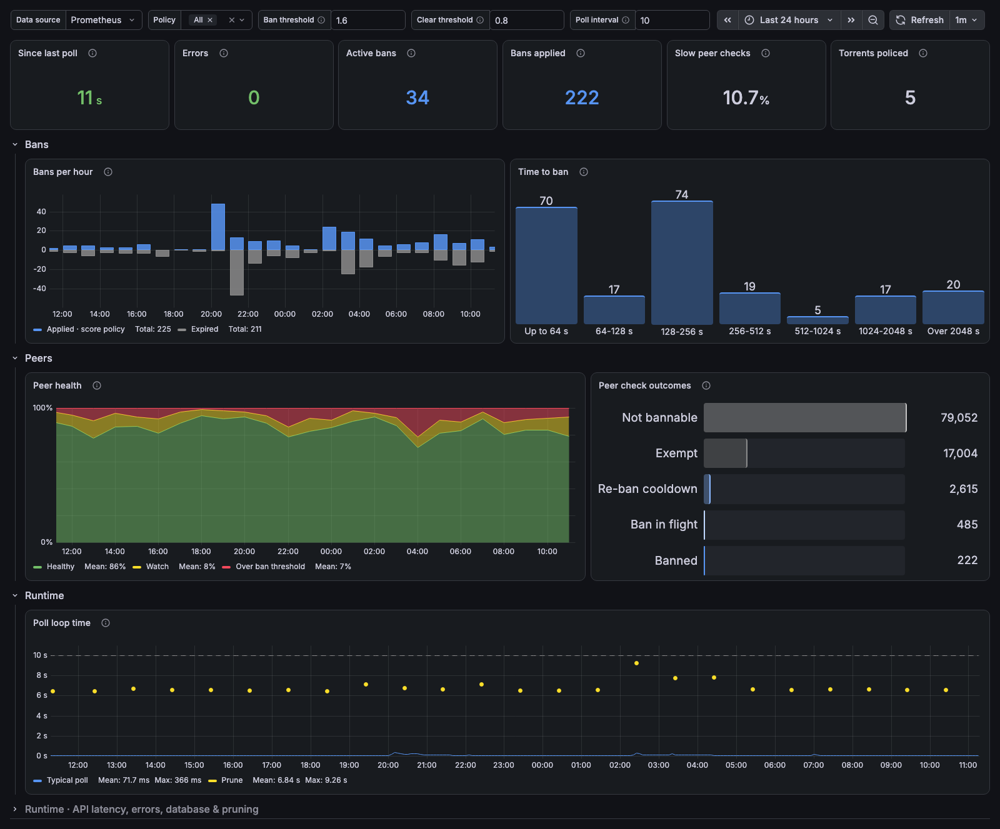
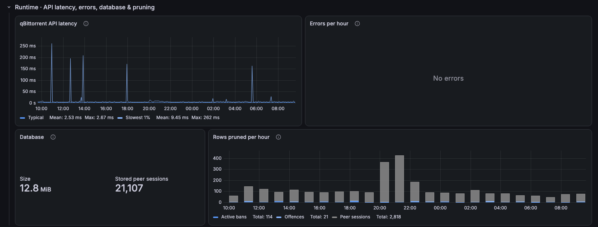

# brrpolice / Overview

brrpolice: status, bans applied, how peers were judged, and how fast it polls qBittorrent.

[grafana.com/grafana/dashboards/25155](https://grafana.com/grafana/dashboards/25155) · import ID `25155`

## Overview

For [brrpolice](https://github.com/zariel/brrpolice), which bans leeching peers in qBittorrent. The top row shows time since the last poll, errors, active bans, bans applied, slow peer checks and torrents policed. Below it, bans per hour, time to ban, peer health against the ban and clear thresholds, peer check outcomes and poll loop time.

The collapsed **Runtime · API latency, errors, database & pruning** row holds qBittorrent API latency, errors per hour, SQLite size and rows pruned per hour.

## Requirements
- brrpolice metrics (`brrpolice_*`) scraped by Prometheus.
- Prometheus 2.33 or later, for negative offsets.
- `ban_threshold`, `clear_threshold` and `poll_interval` variables should match your brrpolice config.

## Collapsed rows

### Runtime · API latency, errors, database & pruning

