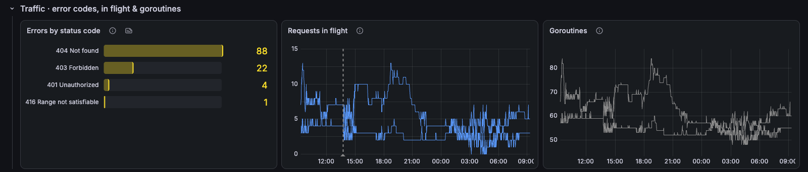
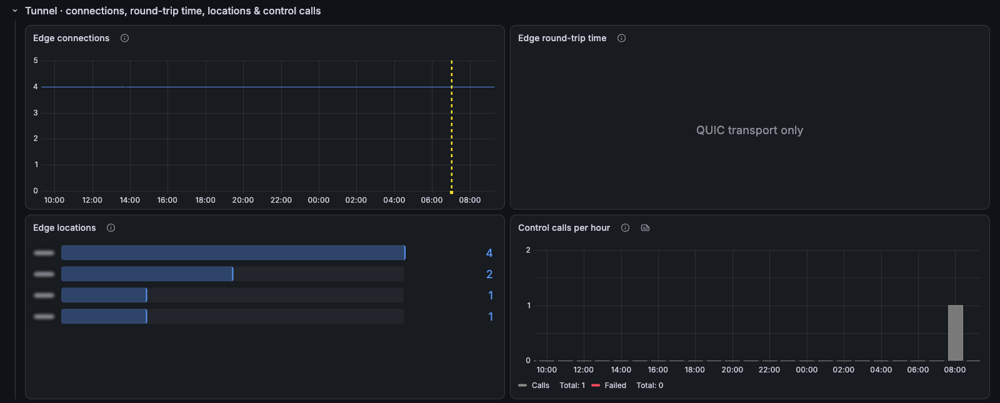

# cloudflared / Overview

Cloudflare Tunnel (cloudflared): tunnel status, request outcomes, throughput, edge connections and runtime cost.

[grafana.com/grafana/dashboards/25868](https://grafana.com/grafana/dashboards/25868) · import ID `25868`

## Overview

The top row shows tunnel health, success rate, requests, requests cancelled by visitors, bytes relayed and reconnects. Below it, requests per hour, throughput, and cloudflared CPU and memory.

Collapsed rows:
- **Traffic · error codes, in flight & goroutines:** errors by status code, concurrent requests and goroutines.
- **Tunnel · connections, round-trip time, locations & control calls:** edge connections per replica, edge RTT (QUIC transport only), connected Cloudflare locations and control-plane RPCs.

Note: cancelled requests are usually visitors closing the page or seeking in media, not origin faults.

## Requirements
- cloudflared started with `--metrics` and scraped by Prometheus (`cloudflared_*`, `quic_client_*`, plus the standard `process_*` and `go_*` collectors).
- Prometheus 2.33 or later, for negative offsets.
- A `job` label to pick the tunnel.

## Collapsed rows

### Traffic · error codes, in flight & goroutines

### Tunnel · connections, round-trip time, locations & control calls

