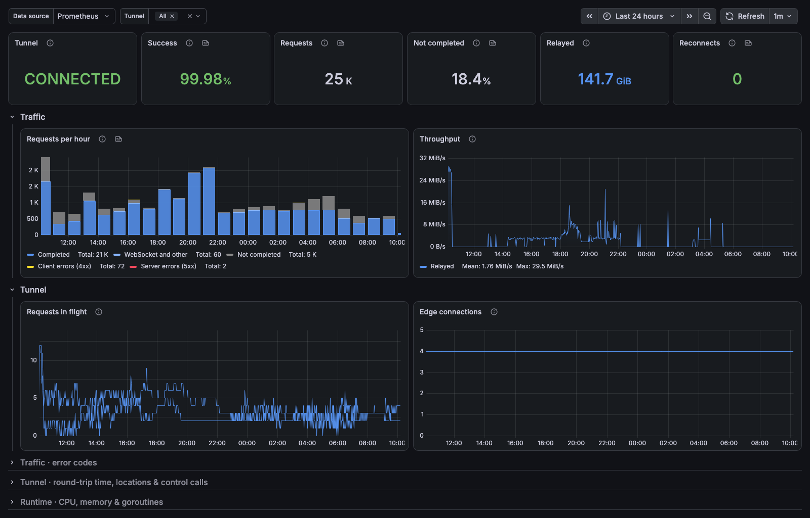
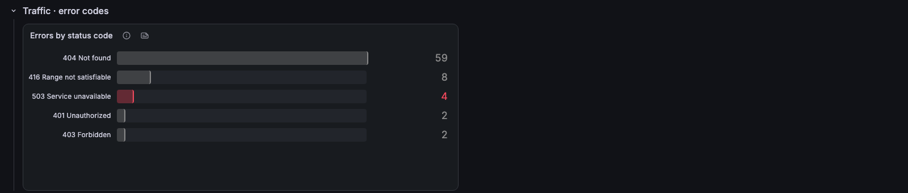
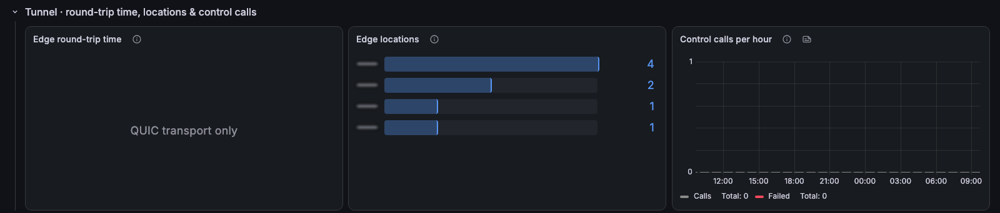
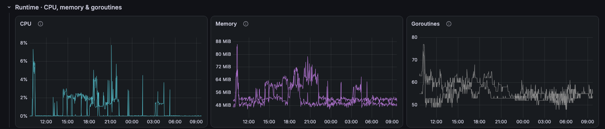

# cloudflared / Overview

Cloudflare Tunnel (cloudflared): tunnel status, request outcomes, throughput, requests in flight, edge connections and runtime cost.

[grafana.com/grafana/dashboards/25868](https://grafana.com/grafana/dashboards/25868) · import ID `25868`

## Overview

The top row shows tunnel health, success rate, requests, requests not completed, bytes relayed and reconnects. Below it, requests per hour, throughput, requests in flight and edge connections per replica.

Collapsed rows:
- **Traffic · error codes:** errors by status code.
- **Tunnel · round-trip time, locations & control calls:** edge RTT (QUIC transport only), connected Cloudflare locations and control-plane RPCs.
- **Runtime · CPU, memory & goroutines:** cloudflared CPU, memory and goroutines.

Note: requests not completed are usually visitors closing the page or seeking in media. An origin that cannot be reached lands in the same count, so a jump there is the signal to check the origin.

## Requirements
- cloudflared started with `--metrics` and scraped by Prometheus (`cloudflared_*`, `quic_client_*`, plus the standard `process_*` and `go_*` collectors).
- Prometheus 2.33 or later, for negative offsets.
- A `job` label to pick the tunnel.

## Collapsed rows

### Traffic · error codes

### Tunnel · round-trip time, locations & control calls

### Runtime · CPU, memory & goroutines

