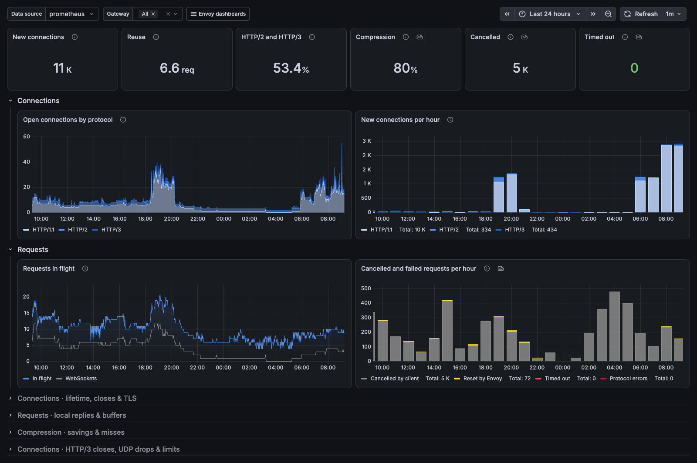
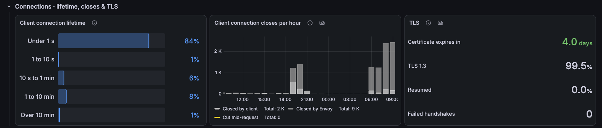
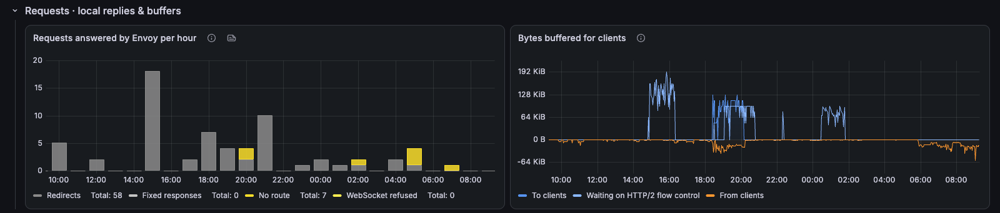
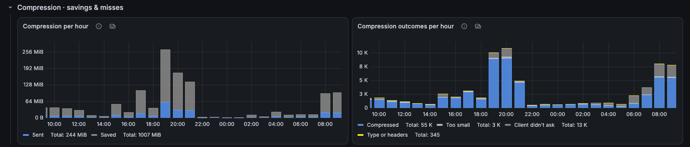
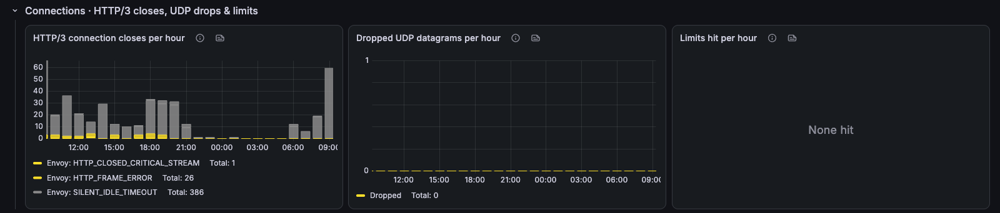

# Envoy Gateway / Downstream

The client side of Envoy Gateway: connections by protocol, requests in flight, cancellations, timeouts, TLS and compression.

[grafana.com/grafana/dashboards/25871](https://grafana.com/grafana/dashboards/25871) · import ID `25871`

## Overview

Everything between clients and Envoy. The top row shows new connections, connection reuse, the HTTP/2 and HTTP/3 share, compression savings, and requests cancelled by clients or timed out. Below it, open connections by protocol and requests in flight against cancelled and failed requests.

Collapsed rows:
- **Connections · lifetime, closes & TLS:** how long client connections live, who closes them and why, certificate expiry and TLS handshakes.
- **Requests · local replies & buffers:** requests answered by Envoy itself (redirects, fixed responses, unknown hosts or paths, refused WebSockets) and bytes buffered for slow clients.
- **Compression · savings & misses:** bytes saved and why responses were not compressed.
- **Connections · HTTP/3 closes, UDP drops & limits:** QUIC close reasons, dropped datagrams and connection or request limits hit.

Companion dashboards: **Envoy Gateway / Overview** and **Envoy Gateway / Upstream**.

## Requirements
- Envoy proxy metrics (`envoy_http_*`, `envoy_listener_*`, `envoy_server_*`) scraped from the Envoy Gateway proxy pods, with a `pod` label.

## Collapsed rows

### Connections · lifetime, closes & TLS

### Requests · local replies & buffers

### Compression · savings & misses

### Connections · HTTP/3 closes, UDP drops & limits

