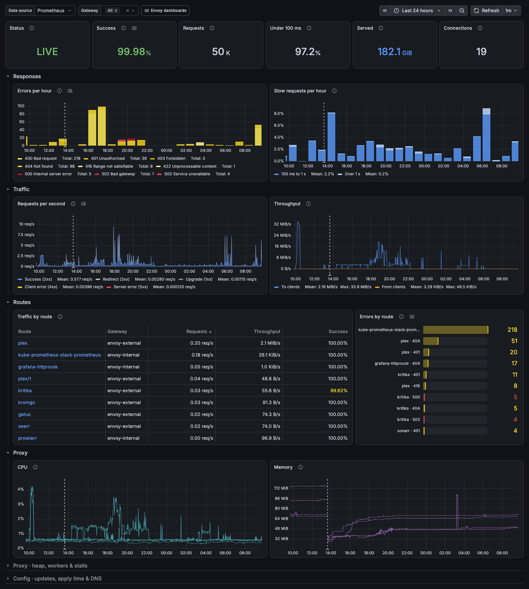
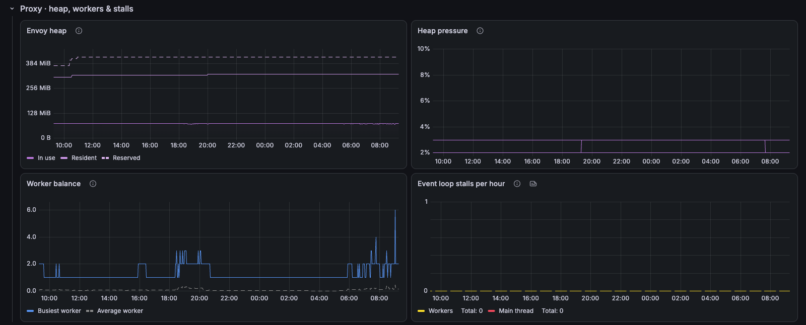
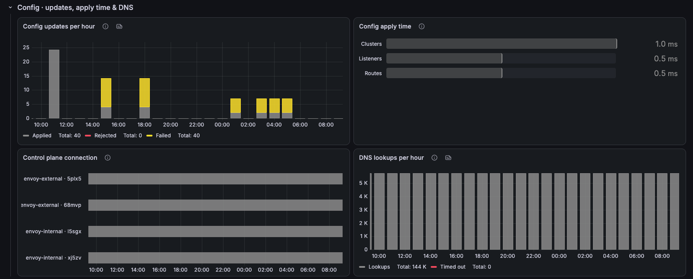

# Envoy Gateway / Overview

Envoy Gateway at a glance: status, traffic, status codes, response time, routes and the proxy's own cost.

[grafana.com/grafana/dashboards/25869](https://grafana.com/grafana/dashboards/25869) · import ID `25869`

## Overview

The first stop for an Envoy Gateway data plane. The top row answers "is it healthy?": gateway status, success rate, request volume, share of requests under 100 ms, bytes served and open connections. Below it, traffic, errors, slow requests, the busiest and failing routes, and proxy CPU and memory.

Collapsed rows hold the detail you only need when something looks off:
- **Proxy · heap, workers & stalls:** Envoy heap, overload heap pressure, worker balance and event loop stalls.
- **Config · updates, apply time & DNS:** xDS updates, config apply time, control plane connection and DNS lookups.

Companion dashboards: **Envoy Gateway / Downstream** (client side) and **Envoy Gateway / Upstream** (backend side, per route).

## Requirements
- Envoy proxy metrics (`envoy_*`) scraped from the Envoy Gateway proxy pods, with a `pod` label.
- Prometheus 2.33 or later, for negative offsets.
- cAdvisor `container_cpu_*` and `container_memory_*` for the CPU and memory panels.

## Collapsed rows

### Proxy · heap, workers & stalls

### Config · updates, apply time & DNS

