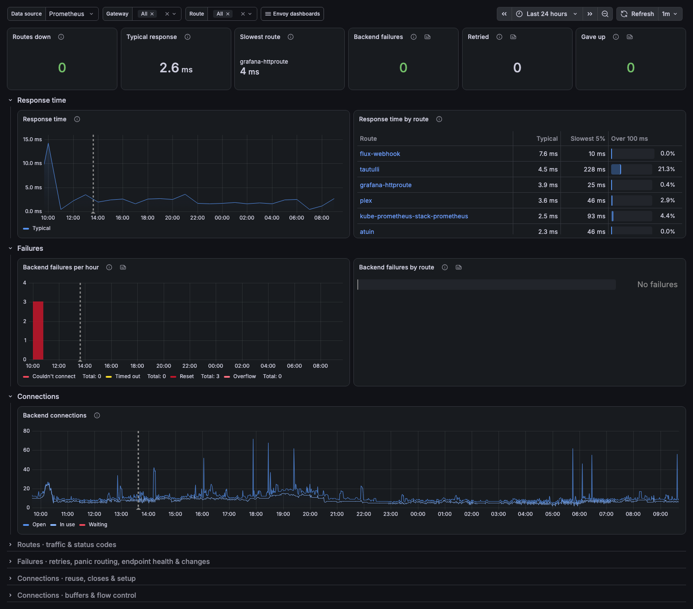
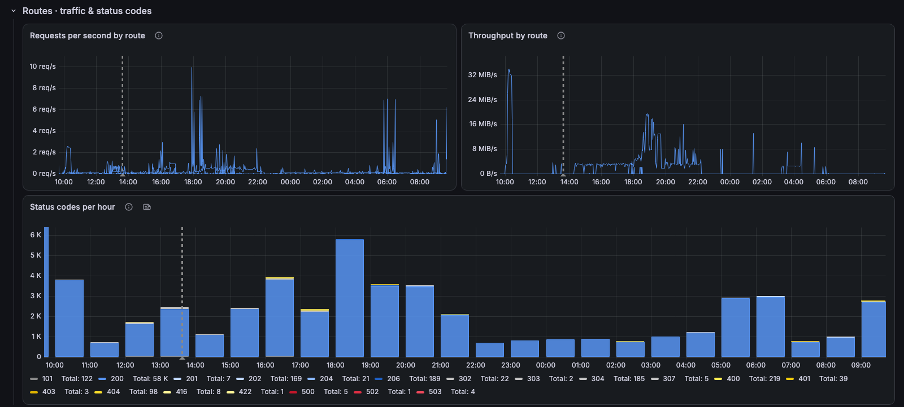
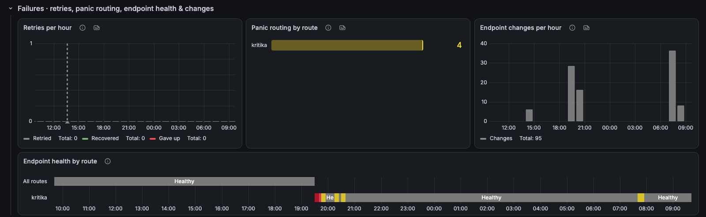
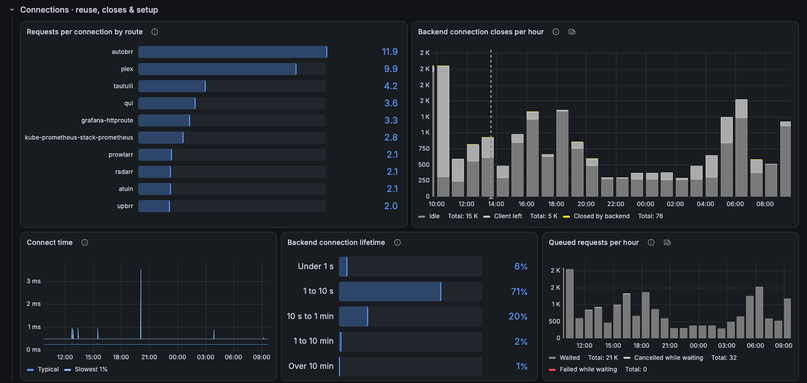
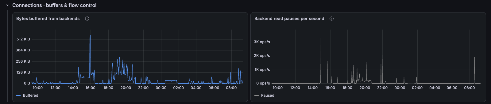

# Envoy Gateway / Upstream

The backend side of Envoy Gateway, per route: response time, failures, endpoint health, retries and connection reuse.

[grafana.com/grafana/dashboards/25870](https://grafana.com/grafana/dashboards/25870) · import ID `25870`

## Overview

How each backend behind Envoy Gateway is doing. The top row shows routes with no healthy endpoints, typical response time, the slowest route, backend failures, retries and requests Envoy gave up on. Below it, response time overall and by route, failures by route and backend connections. A `route` variable narrows every panel to one or more routes.

Collapsed rows:
- **Routes · traffic & status codes:** requests, throughput and status codes per route.
- **Failures · retries, panic routing, endpoint health & changes:** retries, panic-mode routing, endpoint health over time and endpoint churn.
- **Connections · reuse, closes & setup:** requests per connection, close reasons, connect time, connection lifetime and queued requests.
- **Connections · buffers & flow control:** bytes buffered from backends and read pauses.

Notes: per-status-code counters are created lazily by Envoy, so the dashboard counts a route's first error correctly instead of dropping it. Response time runs until the full response is sent, so streaming routes include transfer time.

Companion dashboards: **Envoy Gateway / Overview** and **Envoy Gateway / Downstream**.

## Requirements
- Envoy proxy metrics (`envoy_cluster_*`, `envoy_server_*`) scraped from the Envoy Gateway proxy pods, with a `pod` label.
- Prometheus 2.33 or later, for negative offsets.

## Collapsed rows

### Routes · traffic & status codes

### Failures · retries, panic routing, endpoint health & changes

### Connections · reuse, closes & setup

### Connections · buffers & flow control

