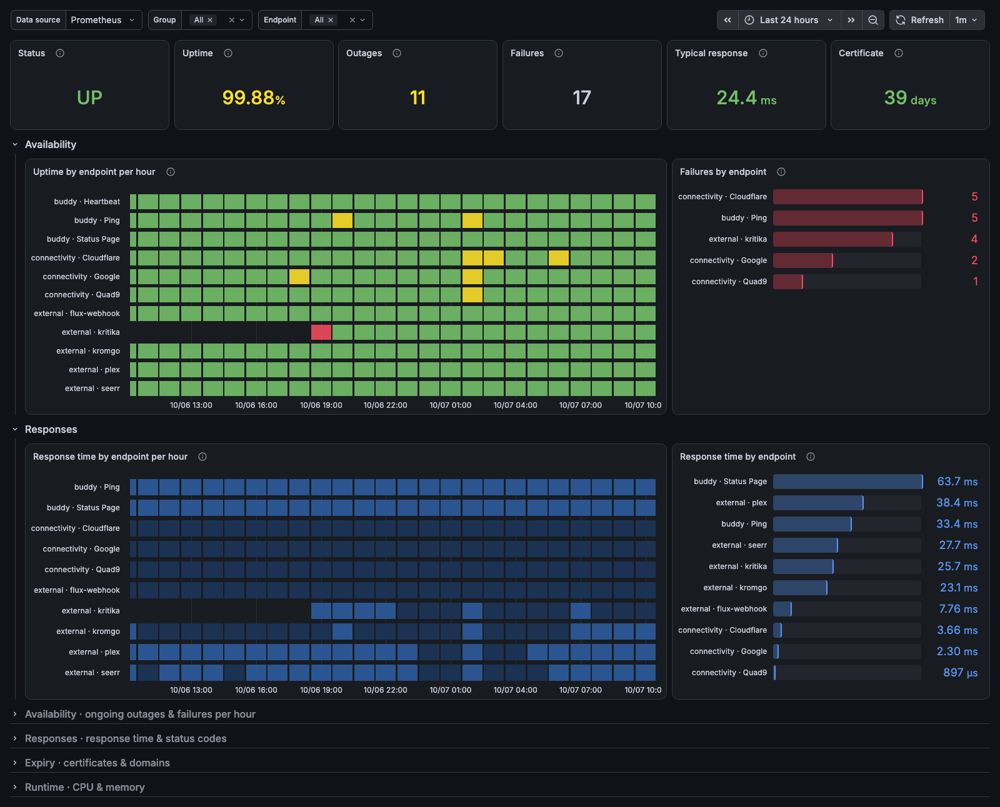
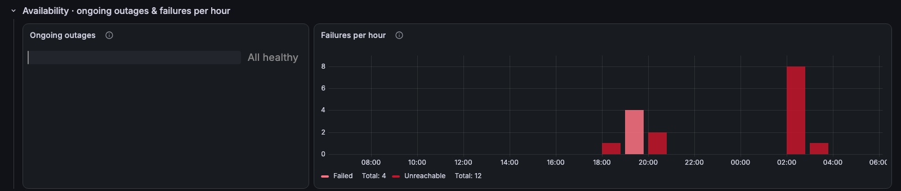
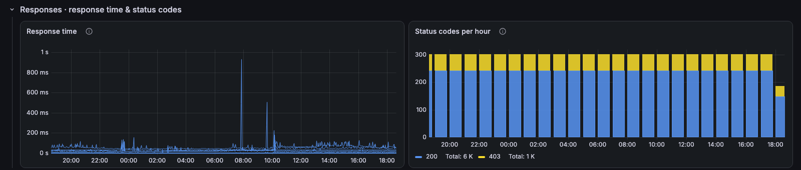
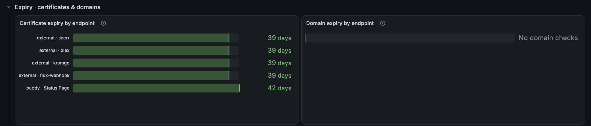
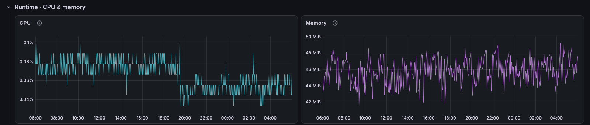

# Gatus / Overview

Gatus: endpoint status, uptime, outages and response times.

[grafana.com/grafana/dashboards/25874](https://grafana.com/grafana/dashboards/25874) · import ID `25874`

## Overview

Built on the Prometheus metrics exported by [Gatus](https://github.com/TwiN/gatus). The top row shows whether every endpoint's latest check passed, then uptime, outages, failed checks, the typical endpoint response time and days until the soonest certificate expires. Below it, uptime by endpoint per hour beside failures by endpoint, and response time by endpoint per hour beside the slowest endpoints.

Collapsed rows:
- **Availability · ongoing outages & failures per hour:** endpoints failing now and for how long, and failed checks per hour split into unreachable and other failures.
- **Responses · response time & status codes:** every check's response time, and the HTTP status and DNS response codes returned.
- **Expiry · certificates & domains:** days until each TLS certificate and domain registration expires.
- **Runtime · CPU & memory:** Gatus CPU and memory.

Notes:
- Response times count passing checks only, so a timeout shows as a failure rather than as slowness. Push (external) endpoints have no response time.
- The hourly grids and bars include the current hour, which fills in as it runs.
- An expected non-2xx code (an endpoint whose condition is `[STATUS] == 403`) still shows in its status class.

## Requirements
- Gatus with `metrics: true` scraped by Prometheus (`gatus_results_*`, plus the standard `process_*` collector).
- Prometheus 2.33 or later, for negative offsets.
- Push endpoints only report a missed push when `heartbeat.interval` is set.
- Domain expiry needs a `[DOMAIN_EXPIRATION]` condition on an endpoint.
- The `group` and `endpoint` variables filter the endpoint panels; Runtime stays deployment-wide. Clicking an endpoint in **Failures by endpoint**, **Response time by endpoint** or **Ongoing outages** selects it.

## Collapsed rows

### Availability · ongoing outages & failures per hour

### Responses · response time & status codes

### Expiry · certificates & domains

### Runtime · CPU & memory

