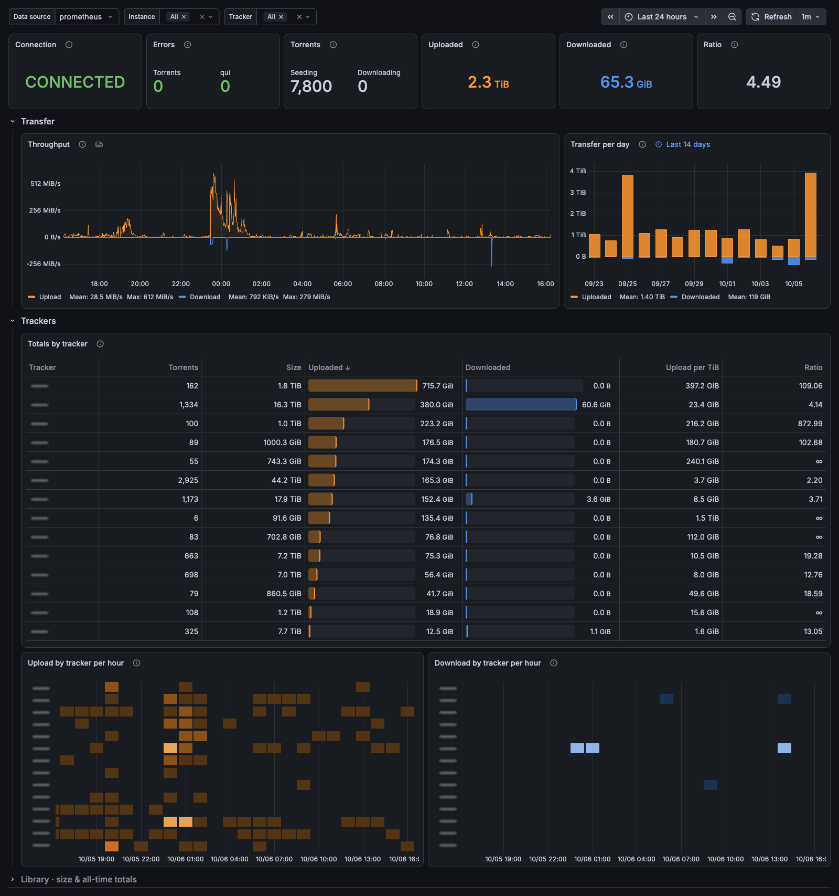
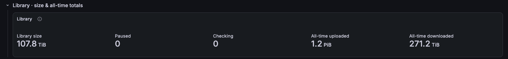

# qBittorrent / Overview

qBittorrent via qui: connection status, transfer, and per-tracker upload, download and activity.

[grafana.com/grafana/dashboards/25156](https://grafana.com/grafana/dashboards/25156) · import ID `25156`

## Overview

Built on the Prometheus metrics exported by [qui](https://github.com/autobrr/qui). The top row shows instance connection, errors, torrent count, uploaded and downloaded in the selected range, and ratio. Below it, throughput, transfer per day, totals by tracker, and upload and download by tracker per hour.

Tracker traffic is filtered so removed torrents don't count. The collapsed **Library · size & all-time totals** row holds library size and all-time totals.

## Requirements
- qui with metrics enabled (`qbittorrent_*`, `qui_*`) scraped by Prometheus.
- Prometheus 2.33 or later, for negative offsets.
- `instance_name` and `tracker` variables select instances and trackers.

## Collapsed rows

### Library · size & all-time totals

