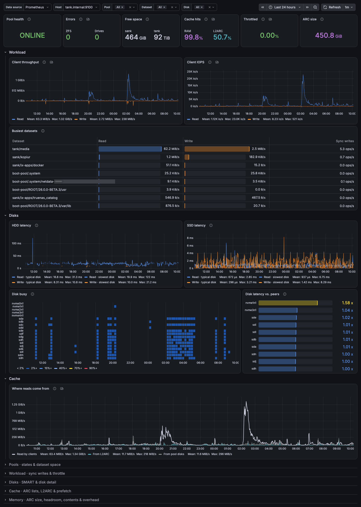
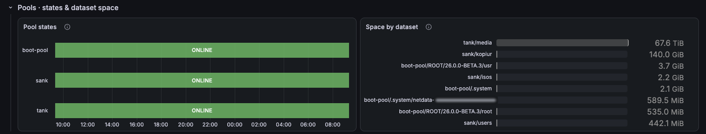
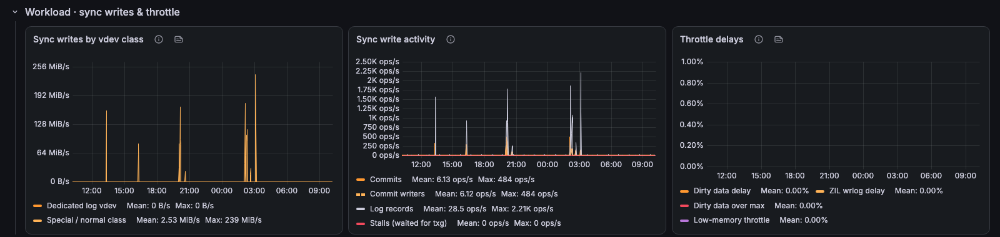
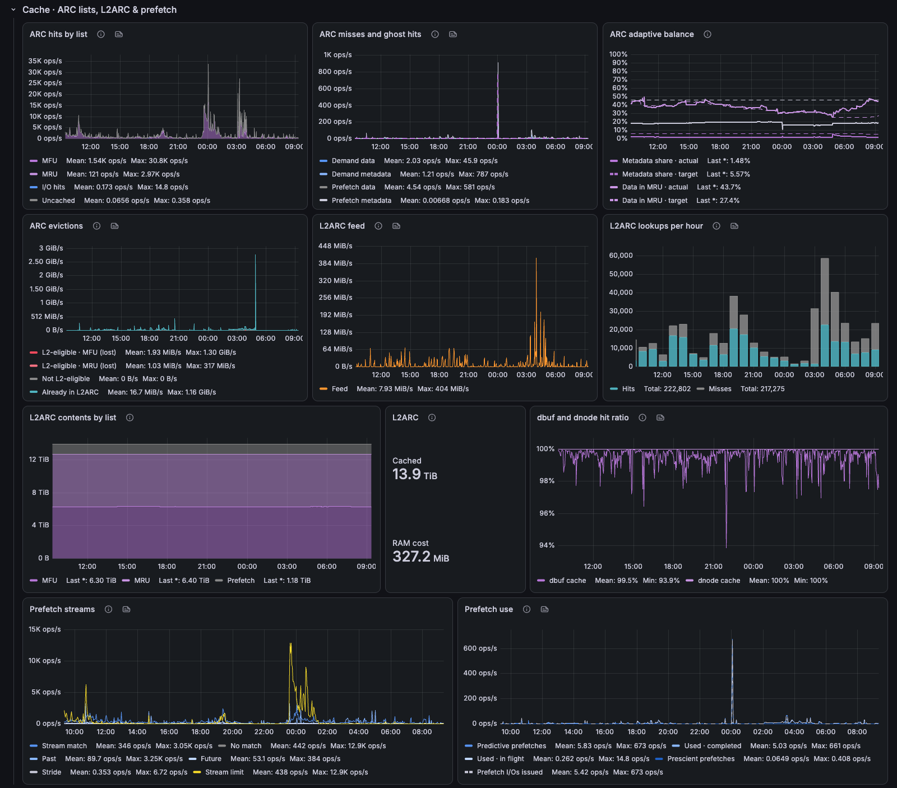
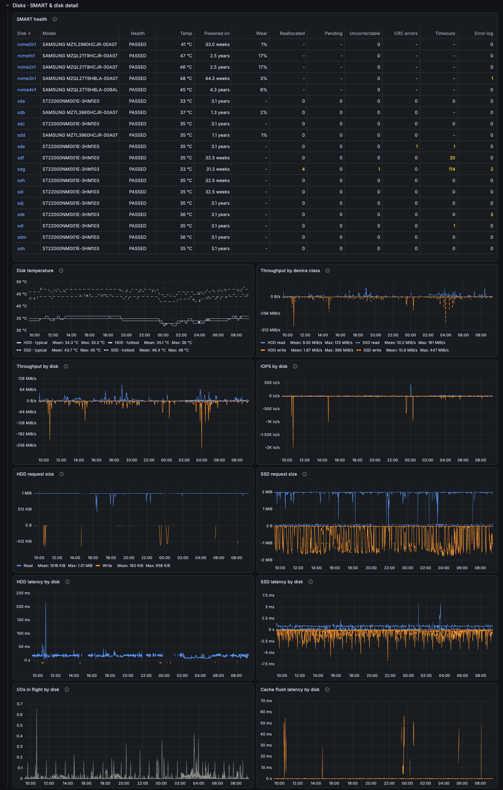
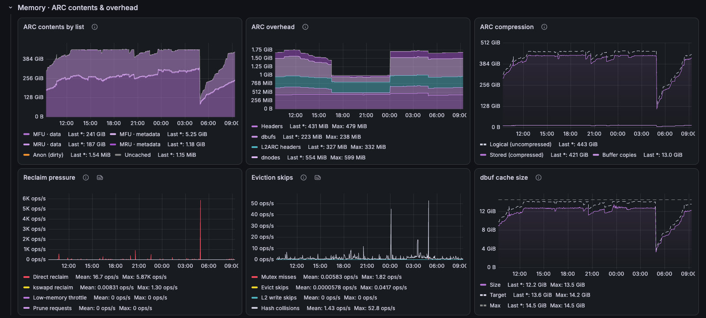

# ZFS / Overview

OpenZFS on Linux from node-exporter and smartctl_exporter: pool health, workload, ARC/L2ARC cache, disks and memory.

[grafana.com/grafana/dashboards/24987](https://grafana.com/grafana/dashboards/24987) · import ID `24987`

## Overview

The top row answers "is the pool OK?": pool health, errors, free space, cache hit rate, write throttling and ARC size. Below it, client throughput and IOPS, busiest datasets, hit rate by tier, where reads come from, HDD and SSD latency, disk busy, disk latency vs. peers (to spot a slow disk), ARC size vs. target and RAM headroom.

Each collapsed row holds the detail for its topic:
- **Pools · states & dataset space**
- **Workload · sync writes & throttle:** sync writes by vdev class (SLOG or special), activity and throttle delays.
- **Cache · ARC lists, L2ARC & prefetch:** MRU/MFU hits, ghost hits, evictions, L2ARC feed and contents, dbuf and dnode hits, prefetch.
- **Disks · SMART & disk detail:** SMART health, temperature, throughput, IOPS, request size, latency, queue depth and cache flush latency per disk.
- **Memory · ARC contents & overhead:** ARC contents, overhead, compression, reclaim pressure and eviction skips.

## Requirements
- node-exporter with the `zfs` collector (`node_zfs_*`) plus the standard `node_disk_*` and `node_filesystem_*` collectors.
- Prometheus 2.33 or later, for negative offsets.
- Optional: smartctl_exporter for the SMART panels.

## Collapsed rows

### Pools · states & dataset space

### Workload · sync writes & throttle

### Cache · ARC lists, L2ARC & prefetch

### Disks · SMART & disk detail

### Memory · ARC contents & overhead

